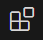
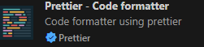

# VS Code 설치

- 검색창에 `VS Code`를 검색하여 `visual Code Studio`를 찾아 다운로드 및 설치하기

# VS Code 실행하기
- 작업폴더에서 마우스 우클릭하여 VS Code 실행하기

# VS Code 플러그인 설치하기

- 검색창에 `Korea` 입력 : `Korea LAn. Pack` 

- 검색창에 `prettier` 입력 : `prettier - Code formatter`

- 검색창에 `EsLint`입력 : `EsLint`설치

- 검색창에 `Icon`입력 : `Material Icon Theme`설치

- 검색창에 `live`입력 : `Live Server`설치

## VS Code 세팅하기
- `ctrl + ,`를 눌러 세팅 실행하기
- Editor, font family : D2Coding으로 변경하기

- formatter 검색하여 `prettier formatter`로 설정하기
